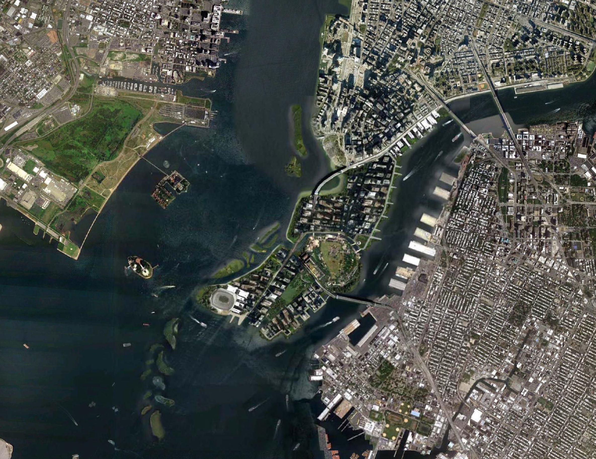
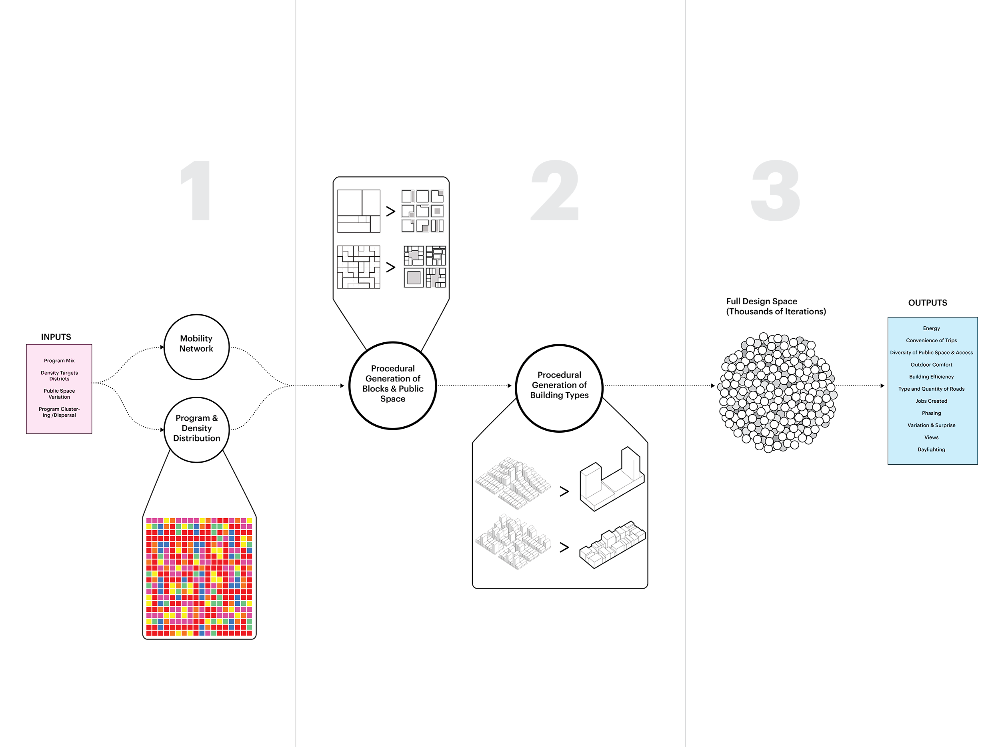
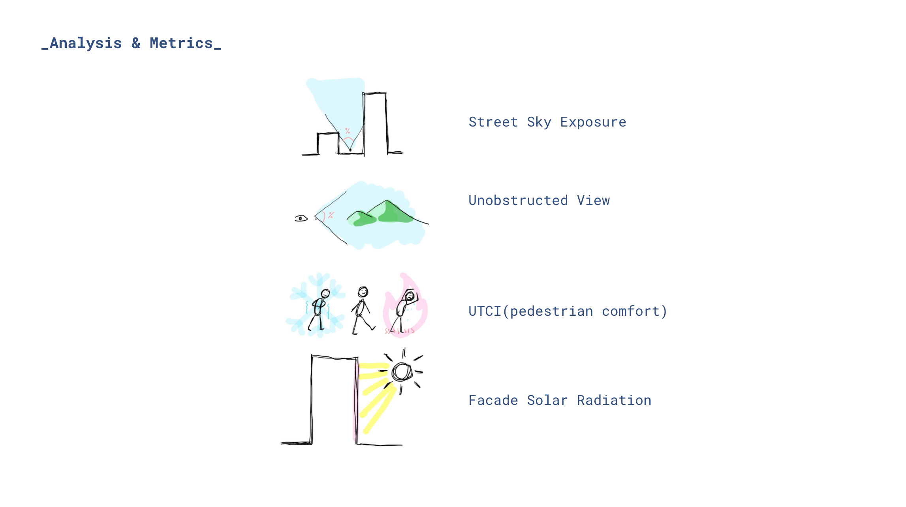
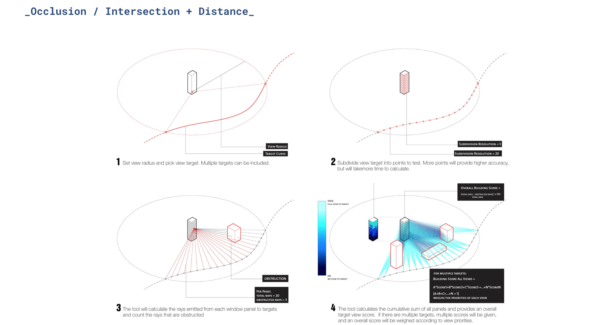
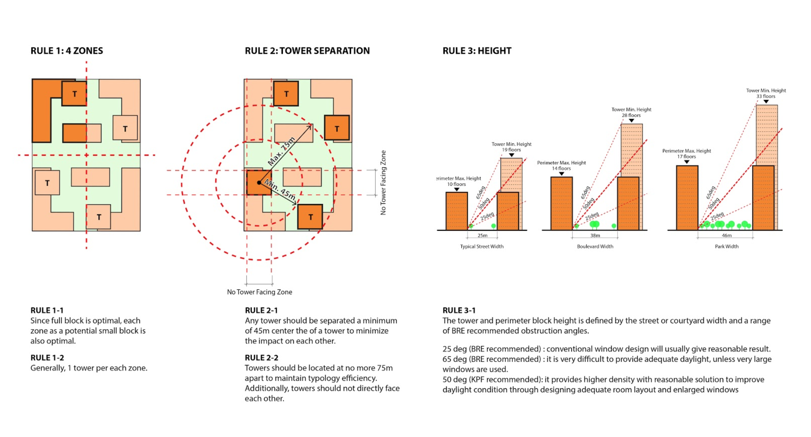
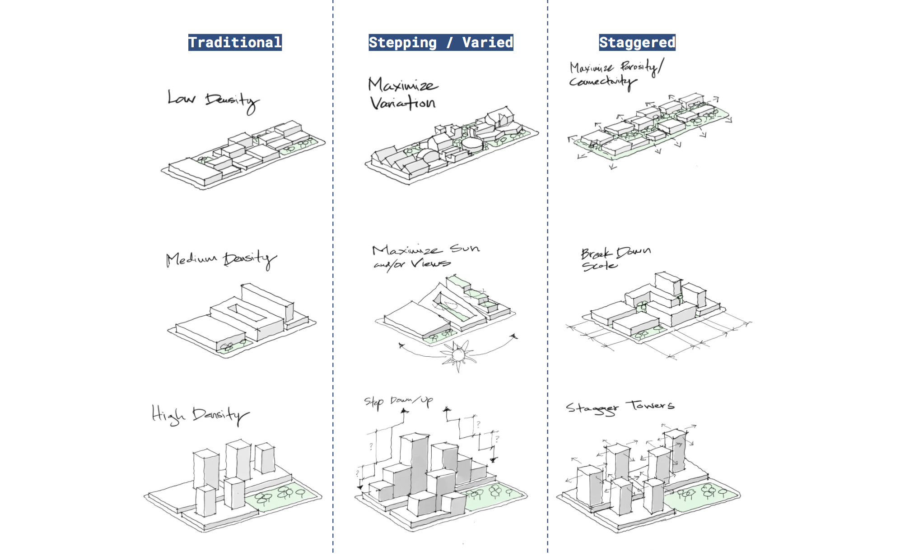

# Energy Efficient Community 

***“Can energy efficient community be achieved in 2050 New York ? ”*** 


This image should be an ***introduction image*** that clearly describes your computational design model.
*Please include a short caption.*

<br />

***

## &nbsp;&nbsp;&nbsp;&nbsp;&nbsp;&nbsp;&nbsp;&nbsp;&nbsp;&nbsp;&nbsp;&nbsp;1. Project Overview

<br />

Extreme carbon emission events are causing climate change. How Will The New York City Act to reduce carbon emission is an issue worth considering. Through this project, we explore the efficiency of differnt grid type, mainly compare orthogonal and voronoi pattern. We are aiming to providing a metro-friendly urban grid to decay car usage , while at the same time designing a energy efficient building type that calls attention to climate change and encourages a lifestyle of public transportation. 


```
“Can energy efficient community be achieved in 2050 New York ? ”
```



This collage shows the urban grid type centered around a subway station.


### Goals and Metrics

Goals：Creating a community Configuration can make the building meet the energy efficiency of winter heat preservation and summer heat insulation, provide convenient access to the metro station and urban public green space for residents, and ensure the green space has sufficient sunlight.


```
For example,
“Through the computational design model, we have identified X and Y trends that allows the city
to address Z while achieving or increasing A and B.”
```

Metric 01: facade sustainbility
In consideration of energy consumption, the building should reduce direct sunlight in summer as much as possible to prevent heat, and increase direct sunlight in winter to ensure insulation. Area that meets both summer shading and winter lighting can be understood as a sustainable area.

Metric 02: metro walkability
In order to fundamentally reduce carbon emissions, we hope to reduce people's reliance on cars and encourage public transport. Therefore, the time of access to Metro station becomes very important. If Community Configuration enables people to walk to the Metro, then more people will choose a low-carbon way of travel.

Metric 03: green walkability
Green space of an ideal community is essential. We set the density and distribution of various green Spaces. How to quantify their advantages and disadvantages, the most intuitive way is to measure the time of walking time from building to green space. Pedestrian-friendly urban green Spaces mean residents have easier access to fresh air and represent a healthy lifestyle.

Metric 04: green space sunlight
The amount and area of green space often cannot be directly used to judge whether it is a good green space for a community. A green space surrounded by high-rise buildings may be permanently shadowed and become a negative space of the city. Therefore, the time that green space gets sunlight in a year is another metric.

Metric 05: walkability to green space with enough sunlight
Light and accessibility of green space are both important, so the more intuitive goal is to make it easier for people to reach good green space with enough light.

### What Did We Discover?


***“ONE NYC 2050” A VISION OF NEW YORK CITY IN 2050*** 

```
In 2050, New York City is prepared for a changing climate, and is no longer reliant on fossil fuels.
In 2050, New Yorkers no longer rely on cars.
In 2050, New York City achieves carbon neutrality and 100% clean electricity.
In 2050, New York City ensures all New Yorkers have access to neighborhood open spaces and cultural resources.
```


<br />

***

## &nbsp;&nbsp;&nbsp;&nbsp;&nbsp;&nbsp;&nbsp;&nbsp;&nbsp;&nbsp;&nbsp;&nbsp;2. Computational Design Model

<br />




### Analysis Tools
* Beneficial Daylight for Facade*


Metric 01: Facade meet requirement: summer sun<6hr/day
Metric 02: Facade meet requirement: winter sun>3hr/day 

* Walkability *


Metric 03: Population that has 7-min access to Metro Station
Metric 04: Population that has 3-min access to Green Space

* Green Space Quality *


Metric 05: Green Space that has average 4 hr sunlight/day 
Metric 06: Population that has 3-min access to Green Space with Average 4 hr Sunlight/Day


####  Beneficial Daylight for Facades Analysis Tool

*Please include a short caption describing your diagram.*

[Link](https://github.com/XIM-GSAPP/XIM-GSAPP-Fa20/tree/main/src/tools) to any packaged analysis tools you have documented and posted.


### Tower with Balconies for Optimal Daylight.

This section focuses on the rules you have defined, range of variability and an explanation of how they relate to you goals and metrics. 

[Link](https://github.com/XIM-GSAPP/XIM-GSAPP-Fa20/tree/main/src/types) to any procedural types you have documented and posted.


*Please include a short caption describing your diagram.*


*Please include a short caption describing your diagram.*

It is encouraged to use sketching when illustrating rules and types of your computational design model.
*Please include a short caption describing your diagram.*


### Procedural Types

* 01: Urban Grid Type*


* 02: Tower Distribution Type*


* 03: Green Space Density*


* 04: Balcony Shape Type*


*  05: Tower Balcony Depth/Height Ratio*

<br />

***

## &nbsp;&nbsp;&nbsp;&nbsp;&nbsp;&nbsp;&nbsp;&nbsp;&nbsp;&nbsp;&nbsp;&nbsp;3. Analysis and Results

<br />

### Exploring the Design Space

We analyzed data from three dimensions which are sustainble facade, walkability and green space quality, and obtained 160 models.
High and low-performing options were selected, and the diagram below showed the options that performed well in the specific metrics but poorly in others.


*Please include a short caption describing your diagram.*

### Design Comparison

We also compare the dimensions synthetically and get several sets of good and bad choices. In the model with better performance, the proportion of radial Metro block is the highest. Among the poor performing models, rotated NYC blocks accounted for the highest percentage. The figure below shows the two sets of models with the best and worst average performance.


*Please include a short caption describing your diagram.*


### Conclusions and Next Steps

For the concluding text of your computational design model documentation, think about the following questions as you reinforce the reason why the results your team's model should implemented.

1. How do you recommend the results of your model be used? Who should learn from this?
1. If we are treating this as a proof-of-concept to illustrate the viability of this type of computational approach to the city, what are the next steps for implementation?
1. Your project evaluation relative to the anti-bias rubric we developed. These include identifying limitations, what this does and does not do or include.


### Overall format and flow of text:

For each of the sections, write the minimum amount that is necessary for your project to be understood by someone reading your post. Each section needs to stand alone but it should not be text heavy. Someone should be able to read through your post in 10 - 15 minutes.
